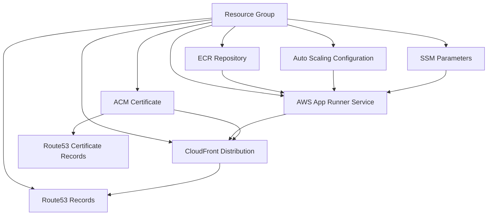

# App Runner stack



> [!NOTE]
> Use Terraform remote state setting values to `backend.tf` file.
> Use `terraform-backend` to create resources for remote state.

## Resources

- **Resource Group**: Groups all resources related to the service
- **AWS App Runner Service**: Main service to run the application
- **Auto Scaling Configuration**: Auto-scaling configuration for App Runner
- **ECR Repository**: Repository to store Docker images
- **CloudFront Distribution**: CDN to distribute content
- **ACM Certificate**: SSL/TLS certificate for HTTPS
- **Route53 Records**: DNS records to point to CloudFront
- **SSM Parameters**: Store configuration values for the App Runner service

## Data flow

1. The code is packaged into a Docker image and sent to ECR
2. App Runner uses this image to deploy the service
3. CloudFront connects to App Runner as the origin
4. Route53 directs traffic to CloudFront
5. ACM provides the SSL certificate for CloudFront

## Get started

1. Create ECR setting `create_apprunner_service` input as `false`
   1. Build and push the image to ECR
2. Create App Runner service using `create_apprunner_service` input as `true`

### ECR

Use the following commands to build and push a Docker image to ECR. Make sure you have the AWS CLI configured with the necessary permissions to access ECR.

```bash
ECR_URL=$(terraform output -raw ecr_repository_url 2>/dev/null)

aws ecr get-login-password | docker login --username AWS --password-stdin $ECR_URL

docker pull --platform=linux/amd64 traefik/whoami:latest
docker tag traefik/whoami:latest "${ECR_URL}:latest"
docker push "${ECR_URL}:latest"
```

### App Runner

Set `create_apprunner_service` input to `true` to create the App Runner service. This will use the Docker image from ECR.