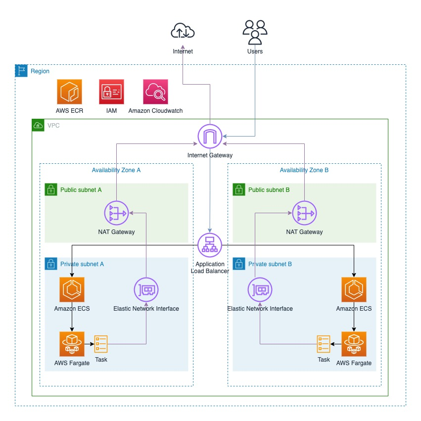

# ECS Fargate Cluster + VPC with NAT Gateway

Elastic Container Service (ECS) Fargate Cluster with VPC, NAT Gateway, Internet Gateway and custom domain with SSL using Terraform.

**See [API Docs](./api-docs.md) for reference.**

> [!NOTE]
>
> Part of this project was based on [Cleber Gasparotto's repository](https://github.com/chgasparoto/youtube-cleber-gasparoto/tree/main/0007-aws-ecs-fargate/app). Check his [YouTube Channel](https://www.youtube.com/c/CleberGasparotto) for more content.

The provisioned resources follow the diagram below (created by Cleber Gasparotto):

## Stack

> [!IMPORTANT]
>
> **Check the pricing of the resources before deploying them.** ECS Fargate Cluster and NAT Gateway are not free. 
> 
> You will be charged for Elastic IPs, NAT Gateway and the resources running on the ECS Cluster.

- ECS Fargate Cluster (free, pay-per-use)
- VPC (CIDR block fixed on `10.0.0.0/16` range to easily control this project, change it if needed)
  - Subnets - 2 Availabity Zones with 1 public subnet + 1 private subnet each
  - Security Groups
  - Route Tables
  - Internet Gateway
  - NAT Gateway (1 per Availability Zone)
  - Elastic IP (1 per NAT Gateway)
- Amazon Certificate Manager
  - Custom SSL Certificate

### VPC + subnets

> [!NOTE]
> 
> VPC CIDR block: `10.0.0.0/16`

The VPC will be created with the following subnets:

- Availability Zone 1 (`us-east-1a`)
  - Public Subnet (CIDR block: `10.0.0.0/20`)
  - Private Subnet (CIDR block: `10.0.128.0/20`)
- Availability Zone 2 (`us-east-1b`)
  - Public Subnet (CIDR block: `10.0.16.0/20`)
  - Private Subnet (CIDR block: `10.0.144.0/20`)

To change CIDR blocks or edit other settings, go to the following folder modules:

- VPC module: [`modules/vpc`](./modules/vpc)
- Subnets module: [`modules/subnet`](./modules/subnet)

### Security Groups

- `default` 
  - Allow all outbound traffic from the VPC
  - Allow all inbound traffic from the VPC
- `cluster_from_internet_to_alb` 
  - Allow inbound traffic from the Internet to the Application Load Balancer (ports 80, 443 and 3000)
  - Allow outbound traffic to the Internet
- `cluster_from_alb_to_ecs` 
  - Allow inbound traffic from the Application Load Balancer to the ECS Cluster
  - Allow outbound traffic to the Internet

### Tags

This project will apply the following tags to all resources:

- `service` - The name of the service
- `stage` - The stage of the service (e.g. dev, prod)

> Check the `default_tags` map on [`provider.tf`](./provider.tf) file.

## Requirements

- Before starting, you need to have a Route53 hosted zone in your AWS account.